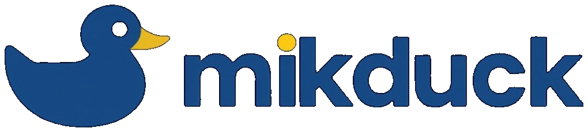
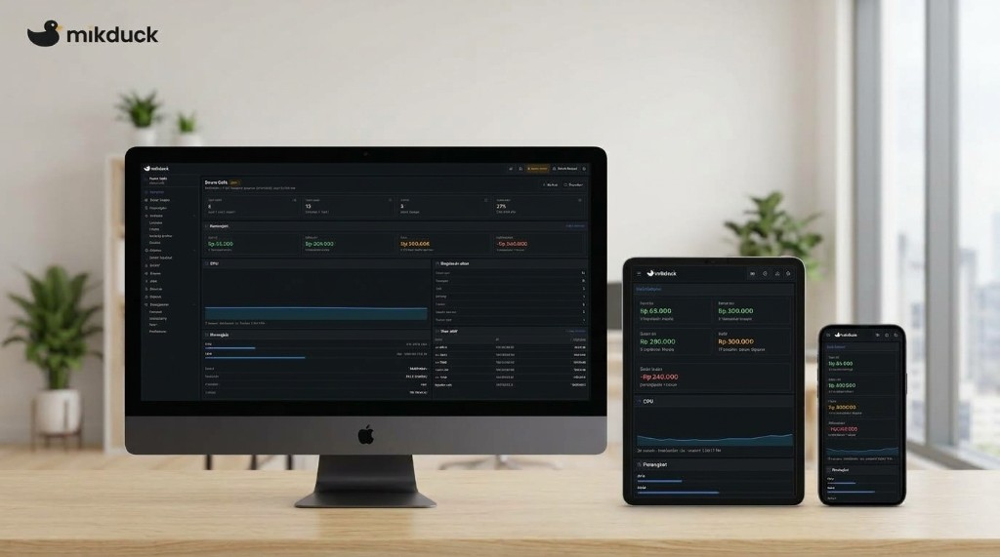
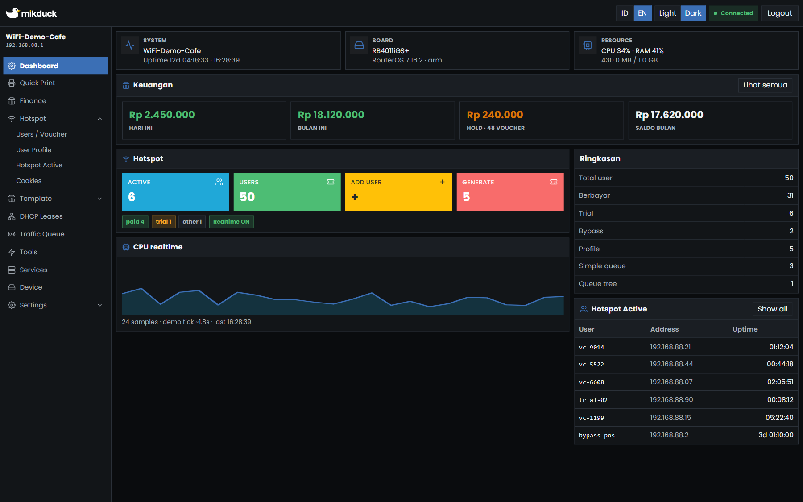
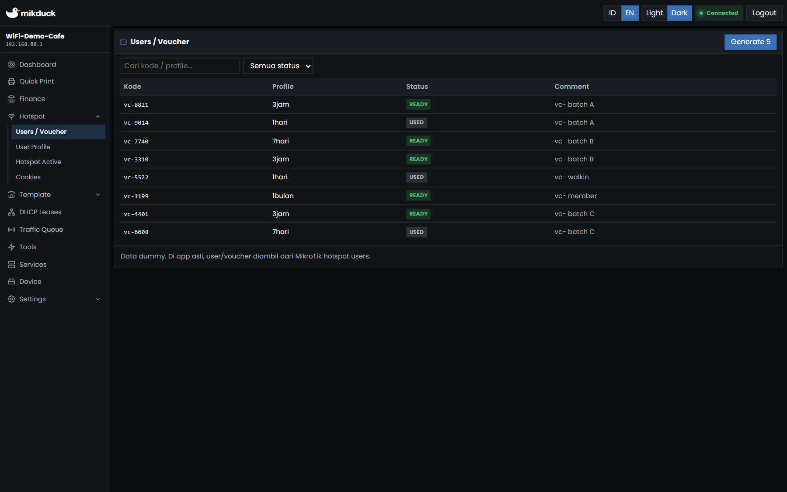
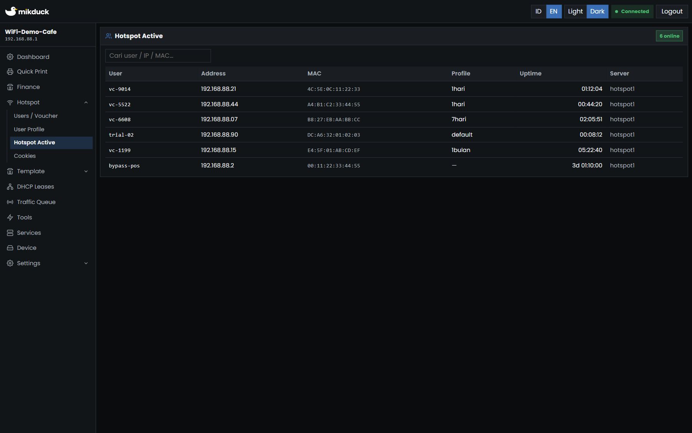
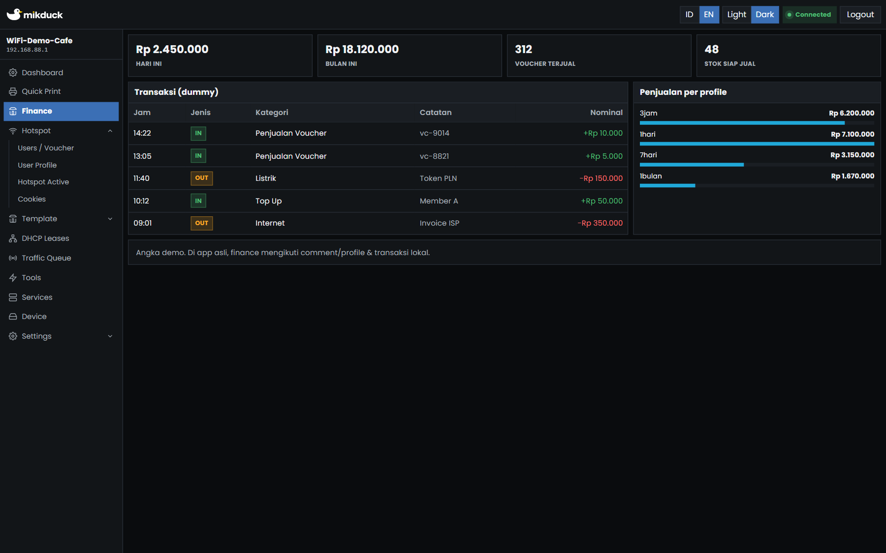
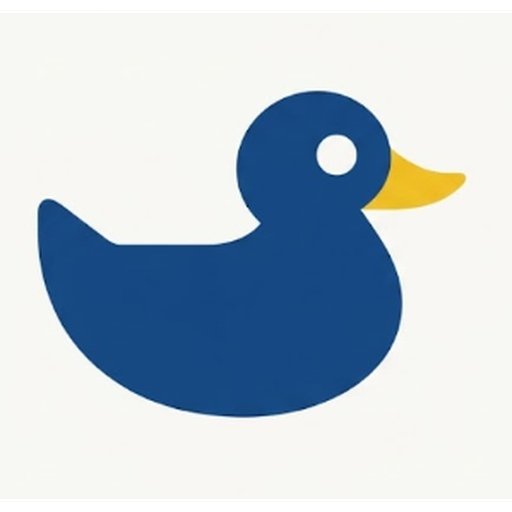

<p align="center">
  
</p>

<p align="center">
  <strong>mikduck</strong> — MikroTik Hotspot Manager<br/>
  Aplikasi desktop open source untuk kelola hotspot MikroTik<br/>
  tanpa PHP, tanpa Apache, tanpa web server.
</p>

<p align="center">
  <a href="https://nazruldev.github.io/mikduck/"></a>
  <a href="https://nazruldev.github.io/mikduck/app-demo/"></a>
  <a href="https://github.com/nazruldev/mikduck/releases/latest"></a>
  <a href="https://github.com/nazruldev/mikduck/wiki"></a>
  <a href="https://github.com/nazruldev/mikduck/discussions"></a>
  <a href="https://www.buymeacoffee.com/nazruldev5"></a>
  <a href="https://www.gnu.org/licenses/agpl-3.0.html"></a>
  
</p>

<p align="center">
  <a href="https://nazruldev.github.io/mikduck/">Website</a> ·
  <a href="https://nazruldev.github.io/mikduck/app-demo/">Live Demo</a> ·
  <a href="https://nazruldev.github.io/mikduck/download.html">Download</a> ·
  <a href="https://github.com/nazruldev/mikduck/releases">Releases</a> ·
  <a href="https://github.com/nazruldev/mikduck/wiki">Wiki</a> ·
  <a href="https://github.com/nazruldev/mikduck/discussions">Discussions</a> ·
  <a href="https://nazruldev.github.io/mikduck/faq.html">FAQ</a> ·
  <a href="https://nazruldev.github.io/mikduck/coffee.html">Coffee</a>
</p>

<p align="center">
  
  <br/>
  <em>Responsive — desktop · tablet · phone</em>
</p>

<p align="center">
  <code>mikrotik</code> ·
  <code>hotspot</code> ·
  <code>voucher</code> ·
  <code>routeros</code> ·
  <code>mikhmon</code> ·
  <code>warnet</code> ·
  <code>wifi billing</code>
</p>

---

## Apa itu mikduck?

**mikduck** adalah aplikasi desktop open source untuk mengelola **hotspot MikroTik (RouterOS)** — alternatif modern **MikhMon** tanpa PHP/Apache:

- Generate & cetak **voucher WiFi** (thermal / A4)
- Dashboard realtime (WebSocket)
- Profile bandwidth, user aktif, cookies, DHCP, queue
- Finance / rekap penjualan voucher
- Multi-router + role operator
- Light / Dark · Bahasa Indonesia & English

Cocok untuk **warnet**, cafe WiFi, hotel, dan ISP kecil yang memakai MikroTik hotspot.

> Bukan produk resmi MikroTik. RouterOS API digunakan sesuai dokumentasinya.

---

## Tampilan aplikasi

<p align="center">
  
  <br/>
  <em>Responsive — desktop · tablet · phone</em>
</p>

<table>
  <tr>
    <td width="50%" align="center">
      <br/>
      <sub><strong>Dashboard</strong></sub>
    </td>
    <td width="50%" align="center">
      <br/>
      <sub><strong>Voucher</strong></sub>
    </td>
  </tr>
  <tr>
    <td width="50%" align="center">
      <br/>
      <sub><strong>Online</strong></sub>
    </td>
    <td width="50%" align="center">
      <br/>
      <sub><strong>Keuangan</strong></sub>
    </td>
  </tr>
</table>

---

## Fitur

| Area | Kemampuan |
|------|-----------|
| **Voucher & Print** | Generate massal, Quick Print, thermal / A4, template kustom, riwayat cetak |
| **Dashboard** | CPU, RAM, user aktif live via WebSocket |
| **Hotspot** | Profile, users, active sessions, kick, MAC binding, cookies |
| **Finance** | Income / expense + sync script Mikhmon dari router |
| **Jaringan** | DHCP leases, traffic queue (read-only), IP services, tools |
| **Akses** | Login app + role operator (generate / hapus / print / finance) |
| **Multi-router** | Simpan banyak router, switch cepat |
| **UX** | Light / Dark, ID & EN, update channel (stable / beta / rc / alpha) |
| **Platform** | Windows Setup + Portable · Linux AppImage + `.deb` |

---

## Live Demo

Coba UI tanpa install:

**[→ Buka Live Demo](https://nazruldev.github.io/mikduck/app-demo/)**

---

## Download

Hanya **versi terbaru** yang ditawarkan (sama seperti di app).

| Platform | File |
|----------|------|
| Windows | Setup (NSIS) · Portable |
| Linux | AppImage · Debian/Ubuntu `.deb` |

**[Download terbaru →](https://github.com/nazruldev/mikduck/releases/latest)**  
Atau lewat website: [download.html](https://nazruldev.github.io/mikduck/download.html)

```text
Windows: jalankan Setup, atau Portable tanpa install
Linux:   chmod +x *.AppImage   ·   sudo dpkg -i *.deb
```

---

## Mulai cepat

1. Unduh installer dari [Releases](https://github.com/nazruldev/mikduck/releases/latest)
2. Aktifkan **API** di MikroTik (biasanya port `8728`) + user API
3. Buka mikduck → tambah router (IP, user, password API)
4. Generate voucher / pantau user aktif

Bantuan: [FAQ](https://nazruldev.github.io/mikduck/faq.html)

---

## Dokumentasi instalasi

| Panduan | Isi |
|---------|-----|
| [System requirements](./docs/System-Requirements.md) | OS, RAM, RouterOS API |
| [Install Windows](./docs/Install-Windows.md) | Setup + Portable |
| [Install Linux](./docs/Install-Linux.md) | AppImage + `.deb` |
| [Connect MikroTik](./docs/Connect-MikroTik.md) | Aktifkan API port 8728 |
| [Update & channel](./docs/Update.md) | Stable / beta / rc / alpha |
| [Troubleshooting](./docs/Troubleshooting.md) | Masalah umum |

Indeks: [docs/README.md](./docs/README.md) ·
[Wiki instalasi](https://github.com/nazruldev/mikduck/wiki) ·
[Discussions](https://github.com/nazruldev/mikduck/discussions)

---

## Channel update

Di **Settings → Preference** user bisa pilih sumber update:

| Channel | Untuk |
|---------|--------|
| **Stable** | Produksi (default) |
| **Beta** | Uji fitur hampir siap |
| **RC** | Calon rilis final |
| **Alpha** | Uji paling awal |

---

## Website & tautan

| | |
|--|--|
| Website | https://nazruldev.github.io/mikduck/ |
| Live Demo | https://nazruldev.github.io/mikduck/app-demo/ |
| Download | https://nazruldev.github.io/mikduck/download.html |
| Changelog | https://nazruldev.github.io/mikduck/changelog.html |
| FAQ | https://nazruldev.github.io/mikduck/faq.html |
| Coffee / support | https://www.buymeacoffee.com/nazruldev5 · [coffee.html](https://nazruldev.github.io/mikduck/coffee.html) |
| Email | [mikduck@nusadev.online](mailto:mikduck@nusadev.online) |
| Releases | https://github.com/nazruldev/mikduck/releases |
| **Wiki** (install docs) | https://github.com/nazruldev/mikduck/wiki |
| **Discussions** | https://github.com/nazruldev/mikduck/discussions |

---

## Lisensi

**[AGPL-3.0](https://www.gnu.org/licenses/agpl-3.0.html)** — bebas dipakai, dimodifikasi, dan dibagikan.  
Lihat file [`LICENSE`](./LICENSE).

Proyek tetap gratis. Dukungan opsional: [Buy Me a Coffee](https://www.buymeacoffee.com/nazruldev5) · [Coffee page](https://nazruldev.github.io/mikduck/coffee.html).

---

## Catatan repo ini

Repo publik **`nazruldev/mikduck`** berisi:

- Website / GitHub Pages
- **GitHub Releases** (installer Windows & Linux)

Source aplikasi dikelola terpisah (private). Issue & diskusi produk boleh dibuka di sini.

---

<p align="center">
  
  <br/>
  <sub>Made for hotspot &amp; warnet operators · Open source · Not affiliated with MikroTik</sub>
</p>
